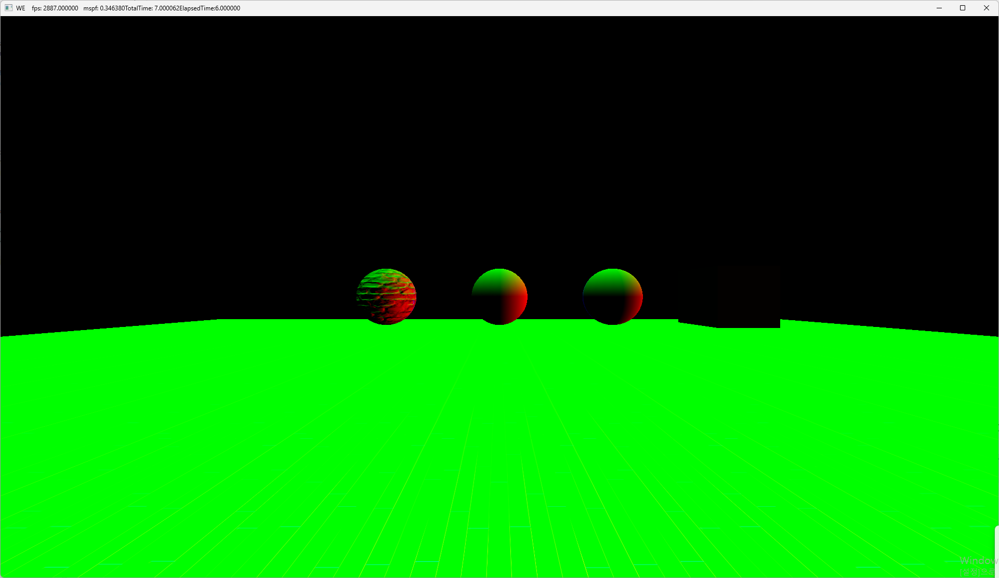
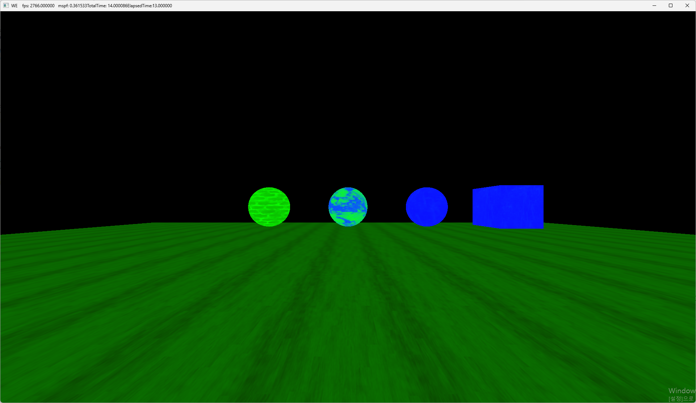
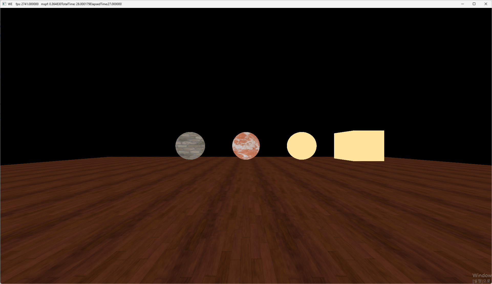
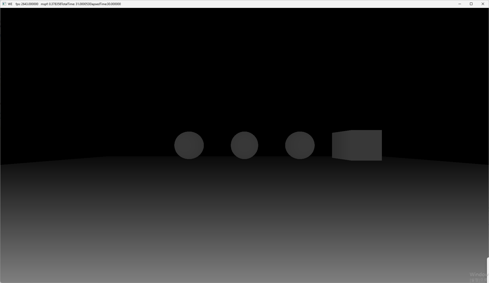
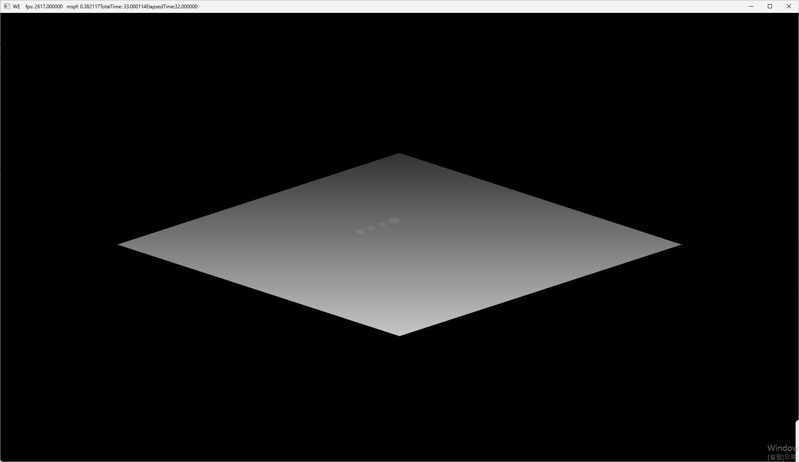
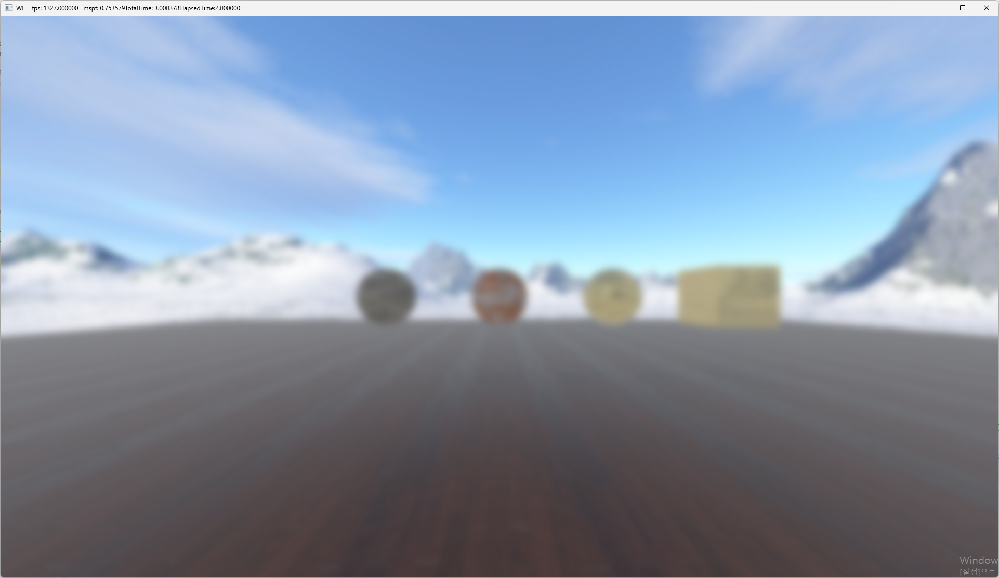

# WhiteEngine
DirectX12 Graphics Engine

DirectX 폴더의 코드는 DirectX12 객체를 관리하거나 관련된 유틸리티 클래스들입니다. 개발을 진행하면서 필요한 부분만 리팩토링하며 저수준의 추상화를 하였기 때문에 다소 불규칙적일 수 있습니다. 

GameFramework 폴더는 UE의 구조를 참고하여 간소화 하였습니다. 월드, 액터, 컴포넌트 같은 기본적인 오브젝트를 정의하였습니다. 월드에 액터가 포함되고, 액터는 컴포넌트로 이루어지도록 구성하였습니다.렌더링에 필요한 정보들은 FRenderItemManager라는 싱글톤 클래스에 복사됩니다.

Render 폴더는 렌더링과 관련된 클래스들이 정의되어 있습니다. FSceneRenderer클래스를 베이스로 하여 ForwardShading과 DeferredShading이 구현되어 있으나, DeferredShading을 구현한 이후 구현된 렌더링 기술은 DeferredShading에만 적용되어 있습니다. 그리고 컴퓨트 셰이더 기반의 가우시안 블러나 환경맵 렌더링같은 렌더링 코드도 구현되어 있습니다. 그 외에도 메시 지오메트리, 텍스처, 머티리얼 같은 렌더링에 사용되는 데이터와 데이터를 로드하는 클래스가 정의 되어있습니다.

Application 폴더는 하나의 프로젝트에 해당하는 폴더입니다. 렌더링 루프와 Tick 함수들, IO를 처리하는 클래스가 정의되어 있습니다. 또한 실질적으로 렌더링 되는 월드와 액터의 하위 클래스들이 정의되어 있습니다.

- Deferred Shading

- GBuffers

- Depth

- Shadow Map

- Gaussian Blur
