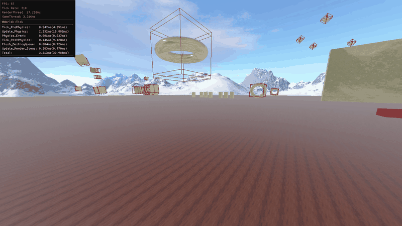
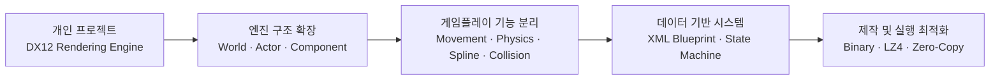
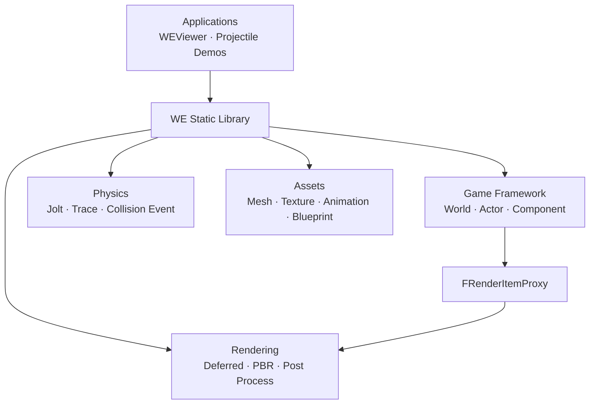
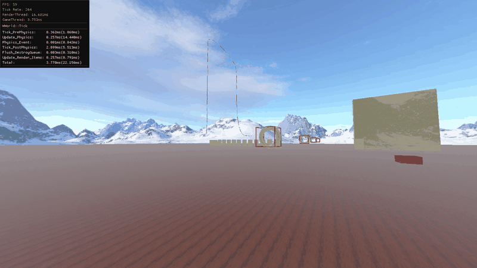
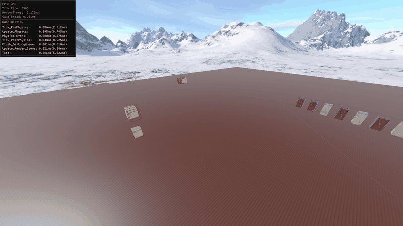

<div align="center">

# WhiteEngine

### DirectX 12 Rendering Engine & Data-Driven Projectile System

개인 DirectX 12 렌더링 엔진에서 시작해<br>
펄어비스 인턴 개인 과제를 통해 게임플레이 시스템과 데이터 제작 파이프라인까지 확장한 프로젝트입니다.

`C++17` · `DirectX 12` · `HLSL` · `Jolt Physics` · `ImGui` · `XML` · `FBX SDK`



<sub>World / Actor / Component, Physics, Projectile, Spline, Collision을 통합한 최종 테스트 장면</sub>

</div>

## 프로젝트 개요

WhiteEngine은 Deferred Rendering과 PBR을 직접 구현하며 시작한 개인 렌더링 엔진입니다. 이후 펄어비스 인턴 기간의 개인 과제에서 기존 렌더러 위에 **World–Actor–Component 구조**, **물리 및 Tick 실행 흐름**, **투사체 컴포넌트**, **XML Blueprint와 State Machine**을 추가했습니다.

단순히 투사체 몇 종류를 하드코딩하는 대신, 기능을 컴포넌트로 분리하고 동작을 데이터로 조합할 수 있는 구조를 만드는 데 초점을 두었습니다.

| 구분 | 내용 |
| --- | --- |
| 개발 형태 | 개인 프로젝트 · 펄어비스 인턴 개인 과제에서 확장 |
| 기반 기술 | C++17, DirectX 12, HLSL |
| 렌더링 | Deferred Rendering, PBR, Shadow Map, Environment Map, Post Process |
| 엔진 구조 | World, Actor, Component, Tick Group, Game/Render Thread |
| 게임 시스템 | Physics, Collision, Projectile Movement, Spline, Object Animation |
| 데이터 파이프라인 | XML Blueprint, Event/Action, State Machine, Binary Compile/Load |

## 개발 흐름



### 1. DirectX 12 렌더링 기반

- Multiple Render Target을 이용해 Geometry Pass에서 G-Buffer를 구성했습니다.
- Normal 저장 포맷을 8-bit에서 16-bit float로 변경해 Specular artifact를 줄였습니다.
- 별도의 Position Buffer를 추가하지 않고 Depth에서 World Position을 복원했습니다.
- Deferred Shading 위에 PBR, Shadow Map, Environment Map과 Compute Shader 기반 Gaussian Blur를 구현했습니다.

### 2. World–Actor–Component 구조

Unreal Engine의 객체 구조를 참고하되 개인 엔진 규모에 맞게 단순화했습니다.

- `WWorld`가 Actor의 생성, 파괴, Tick, 물리 이벤트와 타이머를 관리합니다.
- `AActor`는 여러 Component를 소유하며 하나의 Root Scene Component를 기준으로 계층을 구성합니다.
- `WSceneComponent`는 부모–자식 Transform 전파를 담당합니다.
- 렌더링에 필요한 데이터는 `FRenderItemProxy`로 복사해 Game Thread와 Render Thread 사이의 직접 의존을 줄였습니다.



### 3. 실행 순서와 스레드 분리

물리 시뮬레이션 결과와 게임 로직이 같은 Transform을 서로 덮어쓰는 문제를 막기 위해 한 프레임의 실행 순서를 분리했습니다.

```text
PrePhysics Tick
    → Component Transform을 Jolt에 반영
    → Physics Simulation
    → Jolt 결과를 Component에 반영
    → Physics Event Queue 처리
    → PostPhysics Tick
    → Destroy Queue 정리
    → Render Item 갱신
```

물리 콜백은 Actor나 Component를 즉시 수정하지 않고 Queue에 저장합니다. Transform 동기화가 끝난 뒤 이벤트를 처리하며, `weak_ptr` 기반 수명 확인과 Mutex로 객체 접근 및 스레드 간 동기화를 보호합니다.

## Projectile System

투사체의 이동, 궤적, 애니메이션과 충돌을 독립적인 Component로 나눴습니다. 각 기능은 단독으로 사용할 수 있고 XML Blueprint에서 필요한 조합만 선택할 수 있습니다.

| Component | 역할 |
| --- | --- |
| `WProjectileMovementComponent` | 속도, 가속도, 중력, 수명, 호밍, Waypoint, Bounce |
| `WSplineComponent` | Blender Bezier Curve 로드, LUT 기반 거리 샘플링 |
| `WObjectAnimComponent` | Bone이 없는 오브젝트 애니메이션 재생 및 Curve Binding |
| Collision Components | Box, Sphere, Capsule, Spline 기반 충돌과 Trace |
| `WStateMachineComponent` | 상태, 상속, 이벤트 기반 전이와 상태별 Action 실행 |

<div align="center">



<sub>Blender에서 추출한 Bezier Curve와 거리 LUT를 이용한 Spline 기반 투사체</sub>

</div>

Spline의 Bezier Curve는 해석적으로 전체 길이를 바로 구하기 어렵기 때문에 Segment별 누적 거리를 LUT에 저장했습니다. 이동 거리를 기준으로 Segment를 찾고 보간해 프레임마다 일정한 속도로 Transform을 샘플링합니다.

## XML Blueprint

C++ 클래스를 새로 만들지 않고도 Component 구성과 이벤트 흐름을 데이터에서 정의할 수 있도록 XML Blueprint를 구현했습니다.

```xml
<AStateMachineActor>
    <Components>
        <Movement Name="Movement" InitSpeed="{0, 0, 10}" ShouldBounce="true">
            <Collision Name="HitBox" Type="Box" Extent="{0.5, 0.5, 0.5}">
                <Mesh Name="Body" Asset="SM_MetalCylinder" />
            </Collision>
        </Movement>
    </Components>

    <StateMachine Initial="Global">
        <State Name="Global">
            <OnSpawn>
                <BindCollision Movement="Movement" Collision="HitBox" />
            </OnSpawn>
            <OnHit_HitBox>
                <Hit Damage="100" />
            </OnHit_HitBox>
            <OnDeactivate_Movement>
                <Destroy />
            </OnDeactivate_Movement>
        </State>
    </StateMachine>
</AStateMachineActor>
```

- **Component**: Mesh, Movement, Spline, Object Animation, Collision을 계층적으로 조합합니다.
- **Event**: `OnSpawn`, `OnHit`, `OnBounce`, `OnAnimStop` 등 실행 시점을 정의합니다.
- **Action**: Set, Branch, Timer, SpawnActor, FollowSpline, PlayAnim, Destroy 등을 순서대로 실행합니다.
- **State Machine**: 공통 상태를 상속하고 상태별 Event와 Transition을 재정의합니다.
- **Compile/Load**: XML을 매번 직접 해석하지 않고 런타임 표현으로 직렬화한 뒤 인스턴스를 생성합니다.

<div align="center">



<sub>XML Blueprint와 State Machine으로 회전·호밍 전이를 구성한 투사체</sub>

</div>

## 성능 최적화

병목을 측정한 뒤 데이터 표현, 메모리 접근과 실행 구조를 단계적으로 변경하고 다시 측정했습니다.

| 대상 | 이전 | 이후 | 적용 내용 |
| --- | ---: | ---: | --- |
| 대용량 애니메이션 데이터 로드 | 6,646 ms | 46 ms | Binary Compile, LZ4, Zero-Copy |
| 애니메이션 데이터 용량 | 135 MB | 20.5 MB | Binary Layout, LZ4 압축 |
| 대규모 장면 처리 성능 | 70.9 FPS | 306.9 FPS | Game/Render Thread 분리 |

Animation Sampling에는 Transform Keyframe 포인터 저장, Sampling Index Cache, AoS → SoA와 Zero-Copy 직접 접근을 순차적으로 적용했습니다.

> 위 수치는 인턴 개인 과제에서 수행한 전후 측정값입니다. 로딩 시간, 파일 용량과 스레드 분리 결과는 서로 다른 최적화 실험이며 하나의 누적 벤치마크가 아닙니다.

## 프로젝트 구조

```text
WhiteEngine/
├─ WE/                         # 엔진 코어 정적 라이브러리
│  ├─ Sources/DirectX/         # DX12 리소스와 Descriptor Heap 관리
│  ├─ Sources/Render/          # Deferred Renderer, PBR, Material, Texture
│  ├─ Sources/GameFramework/   # World, Actor, Component, Input, Tick
│  ├─ Sources/Physics/         # Jolt 연동, Trace, Collision Event
│  ├─ Sources/Asset/           # Mesh, Animation, Spline, Blueprint 로더
│  └─ Sources/GUI/             # ImGui 기반 디버그 UI
├─ WEViewer/                   # 전체 시스템과 미니게임 테스트 애플리케이션
├─ WESplineProjectileDemo/     # Spline 투사체 데모
├─ WEProjectileAnim/           # Object Animation 투사체 데모
├─ BlenderScript/              # Spline/Object Animation 데이터 Export
├─ PythonScript/               # Texture 및 GIF 제작 유틸리티
├─ Resources/                  # XML Blueprint와 실행 에셋
└─ ThirdParty/ImGui/           # ImGui 프로젝트
```

### 솔루션 구성

| 프로젝트 | 형식 | 설명 |
| --- | --- | --- |
| `WE` | Static Library | 렌더링, 게임 프레임워크, 물리, 에셋 시스템 |
| `WEViewer` | Application | 통합 테스트 장면과 데이터 기반 Projectile 실행 |
| `WESplineProjectileDemo` | Application | Spline 추종 및 패턴형 투사체 테스트 |
| `WEProjectileAnim` | Application | Object Animation 기반 투사체 테스트 |

## 빌드 환경

- Windows 10 SDK
- Visual Studio 2019 이상 및 MSVC `v142` Toolset
- Autodesk FBX SDK `2020.3.7`
- x64 구성
- Jolt Physics, LZ4, tinyxml2

`WhiteEngine.sln`을 열고 실행할 Application 프로젝트를 시작 프로젝트로 지정합니다. 프로젝트 파일의 FBX SDK Include/Library 경로는 기본 설치 경로인 `C:\Program Files\Autodesk\FBX\FBX SDK\2020.3.7`을 기준으로 설정되어 있습니다.

---

이 저장소는 렌더링 기능 자체뿐 아니라, 기존 개인 엔진을 실제 게임플레이 기능과 데이터 제작 구조로 확장하면서 내린 설계 판단과 문제 해결 과정을 담고 있습니다.
