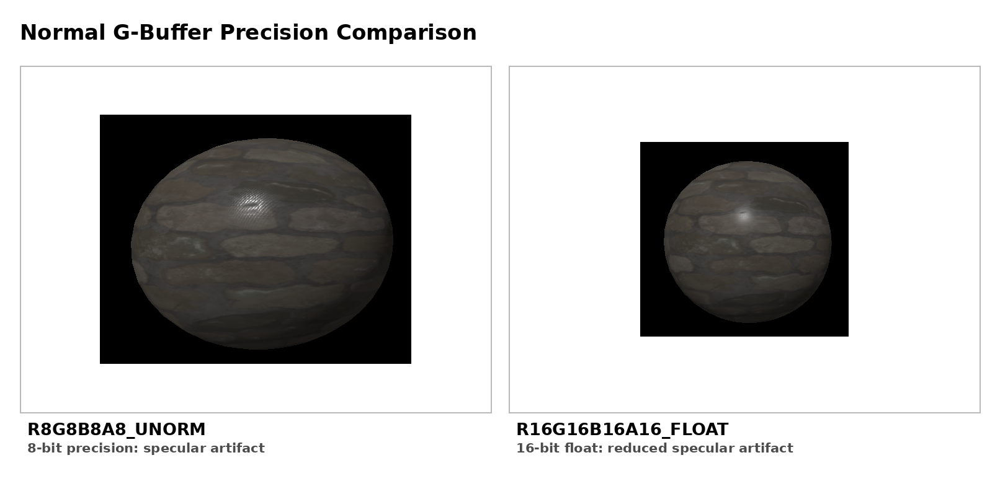

# WhiteEngine

### DirectX 12 렌더링 엔진에서 게임 시스템에 필요한 엔진 구조까지 확장한 개인 프로젝트

인턴 전에는 Deferred Rendering과 PBR을 구현한 개인 렌더링 엔진이었으며, 이후 **펄어비스 인턴 개인 과제**에서 개인 WhiteEngine을 기반으로 World / Actor / Component, Physics, Projectile, Spline, Animation, Collision, XML Blueprint, State Machine을 확장했습니다.

`C++17` · `DirectX 12` · `HLSL` · `Jolt Physics` · `XML`

| 구분 | 기간 | 역할 |
| --- | --- | --- |
| 개인 렌더링 엔진 개발 | 2025.03–2025.05 | 렌더링 엔진 설계·구현, 1인 개발 |
| 펄어비스 인턴 개인 과제 | 2026.01–2026.02 | 게임 시스템 확장·검증, 1인 개발 |

> 펄어비스 구간은 상용 프로젝트나 사내 엔진 개발이 아닌, 개인 WhiteEngine을 기반으로 수행한 인턴 개인 과제입니다.

## 핵심 결과

- 16-bit float Normal로 Specular artifact를 줄였고, 추가 Position Buffer를 두지 않고 Depth로 World Position을 복원하는 대신 복원 연산 비용을 감수했습니다.
- 개인 렌더링 엔진 위에 Component 조합과 XML 데이터로 투사체 동작을 정의하는 엔진 구조를 구축했습니다.
- 인턴 개인 과제의 100,000 Frame / 135MB XML 애니메이션 데이터 로딩 실험에서 `6,646ms → 46ms`를 기록했습니다.

## Demo

### ▶ Rendering Demo

[](https://www.youtube.com/watch?v=nirO4MNBapQ)

[▶ Watch Rendering Demo on YouTube](https://www.youtube.com/watch?v=nirO4MNBapQ)

> 펄어비스 인턴 개인 과제 결과는 별도 YouTube 영상 대신 아래 `Pearl Abyss Internship Project` 섹션의 GIF에서 확인할 수 있습니다.

## 프로젝트 개요

WhiteEngine은 DirectX 12 기반의 개인 렌더링 엔진입니다. 인턴 전까지 Deferred Rendering과 PBR 중심의 렌더러를 개발했고, 펄어비스 인턴 기간에는 이 개인 엔진을 기반으로 게임 시스템에 필요한 엔진 구조와 데이터 제작 흐름을 확장하는 개인 과제를 수행했습니다.

| 단계 | 범위 |
| --- | --- |
| 인턴 이전 — 개인 렌더링 엔진 | Deferred Rendering, PBR, Shadow Map, Environment Map, Post Process |
| 펄어비스 인턴 — 개인 WhiteEngine 기반 개인 과제 | World / Actor / Component, Physics Event Queue, Projectile, Spline, Object Animation, Collision, XML Blueprint, State Machine, 성능 최적화 |

## DirectX 12 Rendering Engine

### G-Buffer / MRT

Geometry Pass에서 Geometry별 출력을 여러 번 그리지 않고 하나의 Pass에서 G-Buffer로 기록하도록 Multiple Render Target을 구성했습니다. 이후 Deferred Shading Pass가 필요한 데이터를 읽는 구조로 분리해 렌더링 흐름을 단순화했습니다.

<p align="center">
  
</p>

### Normal Precision

8-bit Normal 저장에서는 Specular artifact가 나타났습니다. 이를 16-bit float 포맷으로 전환해 화질을 개선했으며, 그 대신 G-Buffer 메모리 사용량이 증가하는 trade-off를 감수했습니다.

<p align="center">
  
</p>

### Depth 기반 World Position 복원

Position Buffer를 별도로 추가하는 방안을 검토한 뒤, Depth와 역 View-Projection 행렬로 World Position을 복원하는 방식을 선택했습니다. Buffer 메모리는 절감할 수 있지만, 복원 연산 비용이 늘어나는 trade-off가 있습니다.

PBR, Shadow Map, Environment Map과 Compute Shader 기반 Gaussian Blur를 구현했으며, Post Process는 Deferred Rendering 결과를 보정하는 단계로 구성했습니다.

## Pearl Abyss Internship Project

이 섹션은 펄어비스 상용 프로젝트나 사내 엔진 개발이 아니라, 개인 WhiteEngine을 기반으로 수행한 인턴 개인 과제입니다.

<div align="center">


<sub>World / Actor / Component, Physics, Projectile, Spline, Collision을 통합한 개인 과제 테스트 장면</sub>

</div>

### 개발 범위

개인 렌더링 엔진 위에 World, Actor, Component 구조와 Physics, Collision, Projectile Movement, Spline, Object Animation을 확장했습니다. 데이터 제작 단계에서는 XML Blueprint와 State Machine으로 Component, Event, Action을 조합할 수 있도록 구성했습니다.

### Engine Architecture와 Event Queue

한 프레임은 `PrePhysics → Physics 반영 → Simulation → Transform 동기화 → Physics Event Queue → PostPhysics → Render Item 갱신` 순서로 처리합니다. 물리 이벤트를 즉시 처리할 때 생길 수 있는 Transform overwrite와 객체 수명 문제를 피하기 위해 Queue로 처리 시점을 분리했습니다.

`mutex`로 Queue 접근을 보호하고, `weak_ptr`와 `shared_ptr`로 이벤트 처리 시점의 객체 수명을 관리했습니다. 렌더링에 필요한 데이터는 `FRenderItemProxy`로 갱신해 Render Item에 반영합니다.

실제 구현에서는 [`World.cpp`](WE/Sources/GameFramework/Object/World/World.cpp)의 `WWorld::Tick`이 `mOnHitEventQueue`를 순회하고, 유효한 두 Component에 각각 `mOnHitDelegate.Execute(...)`를 호출한 뒤 Queue를 비웁니다. 이벤트 추가도 같은 파일의 `EnqueueOnHitEvent`에서 `mEventQueueMutex`로 보호합니다.

### Data-Driven Projectile

Movement, Physics, Spline, Object Animation, Collision을 독립적인 Component로 분리했습니다. XML Blueprint에서 Component / Event / Action을 조합하고, State 상속과 Event Override를 통해 동작을 정의한 뒤 Compile / Load합니다.

| Component | 역할 |
| --- | --- |
| `WProjectileMovementComponent` | 속도, 가속도, 중력, 수명, 호밍, Waypoint, Bounce |
| `WSplineComponent` | Blender Bezier Curve 로드와 LUT 기반 거리 샘플링 |
| `WObjectAnimComponent` | Bone이 없는 오브젝트 애니메이션과 Curve Binding |
| Collision Components | Box, Sphere, Capsule, Spline 기반 충돌과 Trace |
| `WStateMachineComponent` | 상태 상속, 이벤트 기반 전이와 상태별 Action |

<div align="center">


<sub>Blender에서 추출한 Bezier Curve와 거리 LUT를 이용한 Spline 기반 투사체</sub>

</div>

<div align="center">


<sub>XML Blueprint와 State Machine으로 동작을 조합한 데이터 기반 투사체</sub>

</div>

### XML Blueprint 재설계: 문법보다 제작 흐름에 맞추기

초기 XML은 자료형을 직접 선언하고 함수 호출 결과를 다른 함수의 파라미터로 전달할 수 있는 범용 문법에 가깝게 설계했습니다. 사수 피드백에서 비개발자가 빠르게 익혀 사용하기에는 복잡하다는 점을 확인한 뒤, 목표 사용자를 아티스트로 다시 정의했습니다.

그 결과 XML은 `Component → Event → Action` 흐름으로 바꿨습니다. 투사체를 구성하는 Component를 선언하고, `OnHit` 같은 Event 아래에 `Set`, `Branch`, `Timer`, `Destroy` Action을 조합하도록 하여 자료형이나 엔진 함수 호출 구조를 직접 알아야 하는 부담을 줄였습니다. State 상속과 Event Override는 상태별 동작 차이를 데이터로 표현하는 데 사용했습니다.

구현은 XML 문법을 그대로 매 프레임 해석하지 않습니다.

1. [`BlueprintAsset.cpp`](WE/Sources/Asset/BlueprintAsset.cpp)의 `OnCompile`이 XML의 Component, State, Event, Action을 이진 데이터로 직렬화합니다.
2. `SmartLoad`가 소스와 `bin` 결과물의 갱신 시점을 확인한 뒤 이진 버퍼를 Load하고, `DeserializeComponents`와 `DeserializeActions`가 런타임 생성 정보를 복원합니다.
3. [`WComponentRegistry.cpp`](WE/Sources/GameFramework/Object/WComponentRegistry.cpp)와 [`WActionRegistry.cpp`](WE/Sources/GameFramework/Object/WActionRegistry.cpp)의 Registry·Factory가 태그와 속성을 실제 Component 및 Action 생성으로 연결합니다. `BindToActorFactory`는 완성된 Blueprint를 Actor 생성 경로에 등록합니다.

재설계한 문법으로 발표용 투사체를 직접 제작해 제작 흐름을 점검했고, 사수에게 사용 가능성을 검토받았습니다.

### 고속 투사체 충돌: CCD 대안과 Line Trace 선택

박스 Rigid Body를 Tick마다 이동시키면 한 프레임의 이동 구간에서 얇은 벽을 지나칠 수 있어(tunneling) 충돌체를 통과할 위험이 있습니다. 낮은 Tick Rate, 높은 투사체 속도, 벽과 투사체의 두께가 이 현상에 영향을 줍니다.

Jolt의 CCD를 적용하는 대안도 검토했습니다. 이 과제에서는 직전 위치와 현재 위치 사이의 이동 구간을 매 Tick `Line Trace`로 검사하는 방식을 선택했습니다. 이동 경로 자체를 검사하므로 위의 tunneling 조건을 직접 다룰 수 있으며, [`World.cpp`](WE/Sources/GameFramework/Object/World/World.cpp)의 `WWorld::LineTrace`가 `Physics::LineTrace` 호출과 디버그 표시를 제공하도록 구현되어 있습니다.

약 350개 미사일을 둔 **단일 프로파일**에서 다음 값을 기록했습니다. 이 표는 반복 측정 평균이나 모든 장면의 처리 성능을 뜻하지 않습니다.

| 충돌 방식 | 프레임 시간 | Tick | 렌더링 FPS |
| --- | ---: | ---: | ---: |
| RigidBody | 5.502ms | 181 | 299 |
| Trace | 3.987ms | 250 | 299 |

두 방식 모두 렌더링 FPS는 299로 기록됐으며, 이 결과는 해당 단일 프로파일에서 충돌 방식별 상황을 비교한 값입니다.

### 성능 최적화

- 로딩: 6,646ms → 46ms, Binary Compile + LZ4 + Zero-Copy
- 데이터 용량: 135MB → 20.5MB, Binary Layout과 LZ4 압축
- Game/Render Thread 분리 실험: 70.9 FPS → 306.9 FPS

세 수치는 서로 다른 인턴 개인 과제 내부 실험의 전후 측정값이며, 하나의 누적 벤치마크가 아닙니다. Game/Render Thread 수치는 당시 단일 전후 측정값으로, 하드웨어·빌드·장면 조건을 별도로 기록하지 않아 재현 가능한 벤치마크로 제시하지 않습니다.

## 프로젝트 구조

```text
WhiteEngine/
├─ WE/                         # 엔진 코어 정적 라이브러리
│  ├─ Sources/DirectX/         # DX12 리소스와 Descriptor Heap 관리
│  ├─ Sources/Render/          # Deferred Renderer, PBR, Material, Texture
│  ├─ Sources/GameFramework/   # World, Actor, Component, Input, Tick
│  ├─ Sources/Physics/         # Jolt 연동, Trace, Collision Event
│  ├─ Sources/Asset/           # Mesh, Animation, Spline, Blueprint 로더
│  └─ Sources/GUI/             # ImGui 기반 디버그 UI
├─ WEViewer/                   # 전체 시스템과 미니게임 테스트 애플리케이션
├─ WESplineProjectileDemo/     # Spline 투사체 데모
├─ WEProjectileAnim/           # Object Animation 투사체 데모
├─ BlenderScript/              # Spline/Object Animation 데이터 Export
├─ PythonScript/               # Texture 및 GIF 제작 유틸리티
├─ Resources/                  # XML Blueprint와 실행 에셋
└─ ThirdParty/ImGui/           # ImGui 프로젝트
```

### 솔루션 구성

| 프로젝트 | 형식 | 설명 |
| --- | --- | --- |
| `WE` | Static Library | 렌더링, 게임 프레임워크, 물리, 에셋 시스템 |
| `WEViewer` | Application | 통합 테스트 장면과 데이터 기반 Projectile 실행 |
| `WESplineProjectileDemo` | Application | Spline 추종 및 패턴형 투사체 테스트 |
| `WEProjectileAnim` | Application | Object Animation 기반 투사체 테스트 |

## 빌드 환경

- Windows 10 SDK
- Visual Studio 2019 이상 및 MSVC `v142` Toolset
- Autodesk FBX SDK `2020.3.7`
- x64 구성
- Jolt Physics, LZ4, tinyxml2

`WhiteEngine.sln`을 열고 실행할 Application 프로젝트를 시작 프로젝트로 지정합니다. 프로젝트 파일의 FBX SDK Include/Library 경로는 기본 설치 경로인 `C:\Program Files\Autodesk\FBX\FBX SDK\2020.3.7`을 기준으로 설정되어 있습니다.
