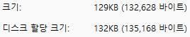
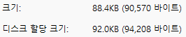

# 1. 최적화 이전 초기 기록

# 2. XML 구조 변경

1. Keyframe 블록 이름 단순화
2. frame을 정수타입, 소수점 4자리로 제한
3. left handle은 이전 keyframe의 보간이 BEZIER일때만, right handle은 현재 keyframe의 보간이 BEZIER일때만 생성하도록 변경

#### 2.1. 변경 전

#### 2.2. 변경후

